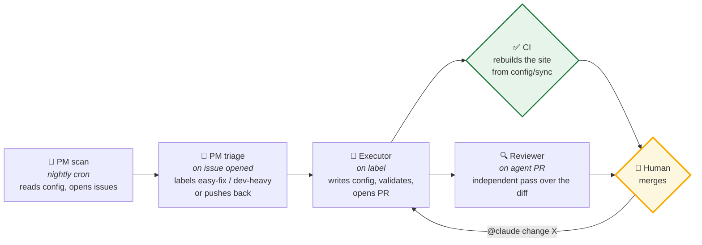

# Drupal Loop AI — demo

Drupal **11.4.4**, config-as-code, with a closed loop of GitHub Actions agents
that scout the backlog, triage it, implement changes, and review each other's
pull requests. **A human holds the merge button and nothing else.**

This is the runnable companion to [`docs/ARQUITECTURA-DOS-CAPAS.md`](docs/ARQUITECTURA-DOS-CAPAS.md)
— specifically *Capa 1: IA en cómo construimos*.

---

## The loop



| Workflow | Trigger | What it may do | What it may **not** do |
|---|---|---|---|
| [`agent-pm-scan.yml`](.github/workflows/agent-pm-scan.yml) | nightly cron, manual | open ≤3 issues | touch code, open PRs |
| [`agent-pm-triage.yml`](.github/workflows/agent-pm-triage.yml) | issue opened/edited | label, or ask for detail | touch code |
| [`agent-resolve-issue.yml`](.github/workflows/agent-resolve-issue.yml) | `easy-fix`/`dev-heavy` label, `@claude` | write config, push a branch, open a PR | merge |
| [`agent-code-review.yml`](.github/workflows/agent-code-review.yml) | agent-authored PR | leave one review | approve, merge, push |
| [`ci.yml`](.github/workflows/ci.yml) | every PR + push to main | rebuild the site from config | — |

Two properties are worth pointing at during the demo:

1. **No agent can merge.** Permissions are scoped per workflow; the reviewer is
   explicitly forbidden from `--approve`. The loop produces reviewed, tested
   candidates, not deployments.
2. **The gate is real, not a lint.** `ci.yml` installs Drupal from
   `config/sync/` on a throwaway SQLite database. Config that references a
   missing field storage, violates a schema, or was hand-edited without
   `drush config:export` fails the build. An agent cannot talk its way past it.

---

## Local setup

Requires PHP 8.3+, Composer, and the SQLite PDO extension.

```bash
composer install

cp web/sites/default/default.settings.php web/sites/default/settings.php
chmod u+w web/sites/default web/sites/default/settings.php
printf "\n\$settings['config_sync_directory'] = '../config/sync';\n" \
  >> web/sites/default/settings.php

# Rebuild the site from committed config.
./vendor/bin/drush site:install --existing-config \
  --db-url=sqlite://sites/default/files/.ht.sqlite --yes

./vendor/bin/drush runserver   # http://127.0.0.1:8888
./vendor/bin/drush uli         # one-time admin login link
```

To make a structural change by hand, edit YAML in `config/sync/`, re-run the
`site:install --existing-config` command above, then `drush config:export --yes`
and commit. See [CLAUDE.md](CLAUDE.md) for the full convention set — the agents
read that same file.

---

## Required repository secret

The agent workflows authenticate with a Claude subscription, not API credits:

| Secret | How to get it |
|---|---|
| `CLAUDE_CODE_OAUTH_TOKEN` | Run `claude setup-token` locally, then `gh secret set CLAUDE_CODE_OAUTH_TOKEN` |

Without it, `ci.yml` still runs but every `agent-*` workflow fails at the
Claude step.
