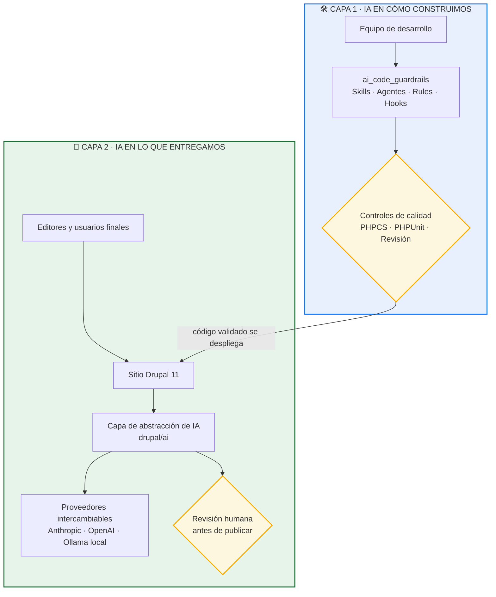
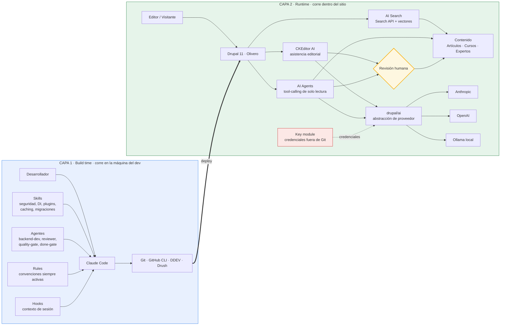
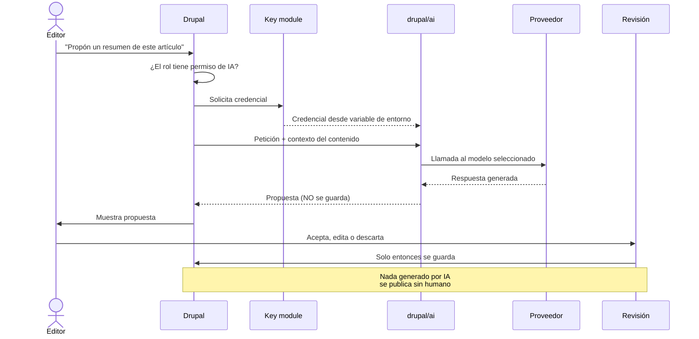

# Arquitectura de dos capas: IA en cómo construimos + IA en lo que entregamos

## Diagrama 1 — Vista ejecutiva (para el cliente)

**Mensaje:** la misma disciplina de ingeniería se aplica en las dos capas. No es "le pusimos un chatbot al sitio".

---

## Diagrama 2 — Vista técnica (para el equipo del cliente)

---

## Diagrama 3 — El flujo de una petición con gobernanza

---

## Notas para presentar

- **Capa 1 no se despliega.** Vive en el entorno de desarrollo. Cero superficie de ataque en producción, cero dependencias nuevas en el sitio.
- **Capa 2 sí se despliega.** Por eso lleva Key module, permisos por rol, logging y revisión humana obligatoria.
- **El rombo amarillo es el punto de venta.** La IA propone, la persona decide. Nunca al revés.
- **Los tres proveedores en paralelo** son el argumento anti-lock-in: si el cliente quiere todo local por privacidad, Ollama; si quiere máxima calidad, Anthropic. Mismo código.
